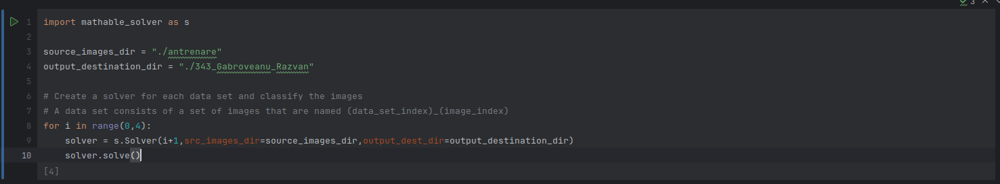

## Quick setup and requirements

### Requirements
- Python 3.12.7
- opencv 4.10.0
- matplotlib 3.9.2
- tqdm 4.66.5
- numpy 2.1.3
- notebook 7.2.2

### Environment setup

There is a .yml file of the conda environment named environment_cava.yml.
It can be build using:

```bash
    conda env create -f environment_cava.yml
```

The environments should be activated by default, otherwise it can be activated manually.

```bash
    conda activate environment_cava
```

Manual line by line installation:

```bash
    conda create --name environment_cava 
    conda activate environment_cava 
    conda install -c conda-forge opencv 
    conda install matplotlib 
    conda install tqdm 
    conda install notebook 
```

## How to run the solver

The jupyter notebook file [main.ipynb](./main.ipynb) contains the main cell that initializes and runs solvers for all 3 tasks.

The 2 main variables are:
 - source_images_dir  - the path to the directory where all images are located
 - output_destination_dir - the path to the directory where the output will be stored

### Notes
The project contains 4 different template directories. The templates used to classify each game cell are in [templates_cropped](./templates_cropped) directory. This directory must not be changed.
